# MelodyMingle - Your Soundtrack to New Connections

Melody Mingle is a social network focusing on connecting people through music. Create and customize your profile, import your favorite music with Spotify and <i>mingle</i> with people whose taste inspires you!

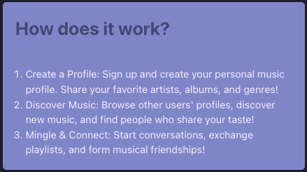

## Project setup

1. Create `.env` for backend
2. run `docker compose up`
3. run `docker exec -it backend npm run db:generate` in a second Console to generate the db migrations
4. run `docker exec -it backend npm run db:migrate` to create the db schema
5. The Application can now be accessed on http://localhost:5173

## Spotify Integration

- Create Spotify Account and Login on https://developer.spotify.com/
- Create App
- Fill fields
- Add `http://localhost:3000/auth/spotify/redirect` to Redirect URIs
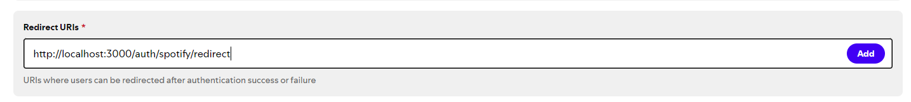
- Create Project
- Go to Project settings
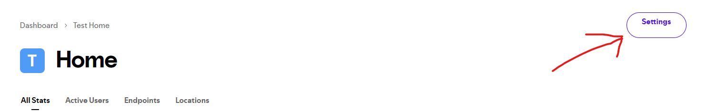
- Copy Client ID & Client Tokens and insert into backend .env
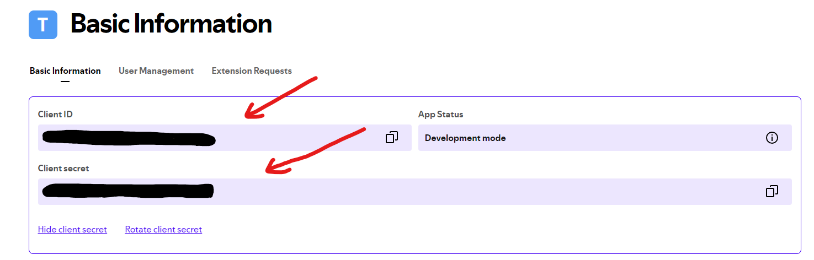

## Features

### Edit and Customize Profile

### Connect your Spotify Account
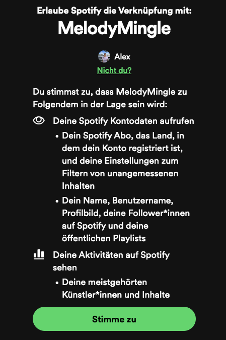

### Chose and Show your Favorite Song

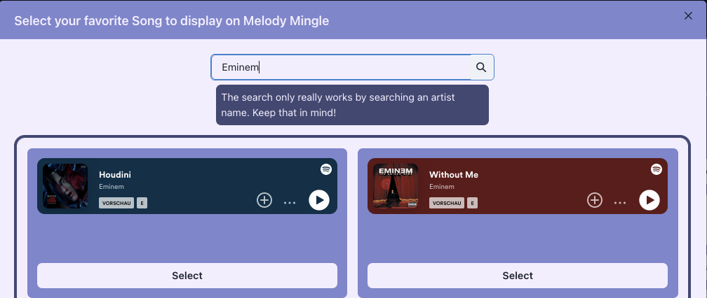

### Match Profiles by Liking or Disliking (Tinder Style)
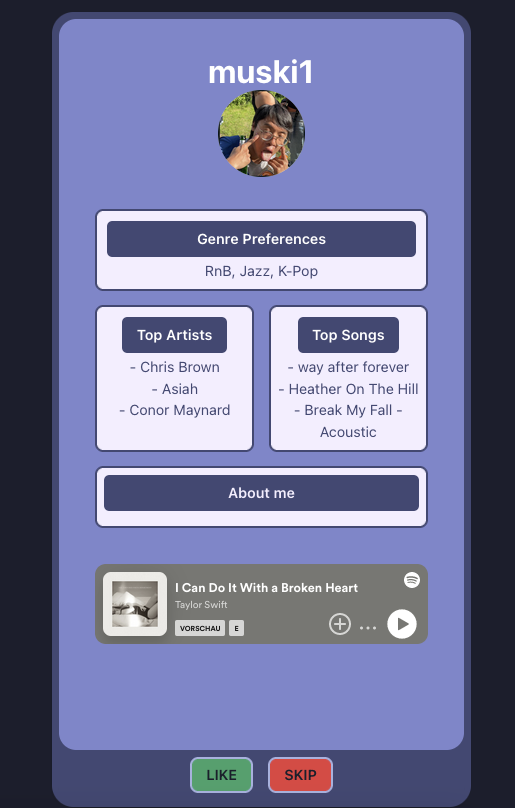
### Listen to a preview to their favorite Song within MelodyMingle

### Chat with Mutual Connections

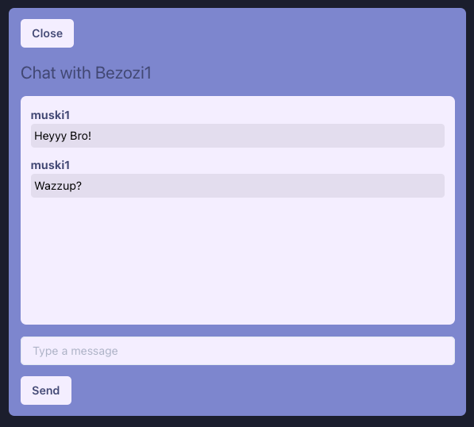

### Create Groups and Chat with Everybody

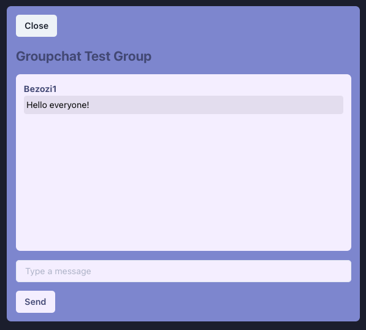

### Create, Show and Find Events

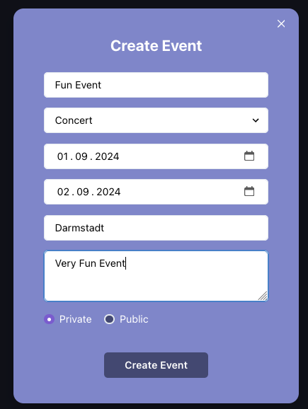
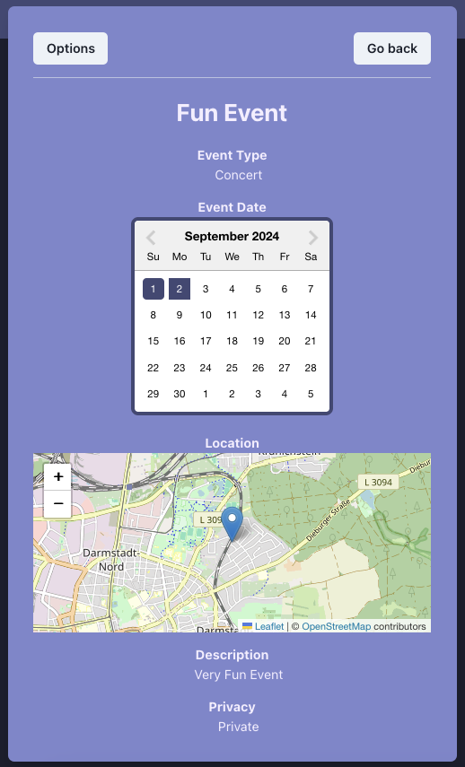

## CI Pipeline
The implemented CI/CD Pipeline automatically runs tests for the backend to ensure stability and maintain functionality of the application during development.

## Frontend Tests

To run the frontend tests 
1. Open a Console 
2. cd into frontend/
3. run `npm install` 
4. run `npm run test`  (on error / if cypress isn't found run `npx cypress install` before)

NOTE: The application must be up and running via `docker compose up` with finished database migrations.

NOTE: After the tests have been run the database has to be rebuild since users which are created during the test process are not deleted afterwards
(In the future the tests should be run inside the CI Pipeline inside a disposable docker container)
